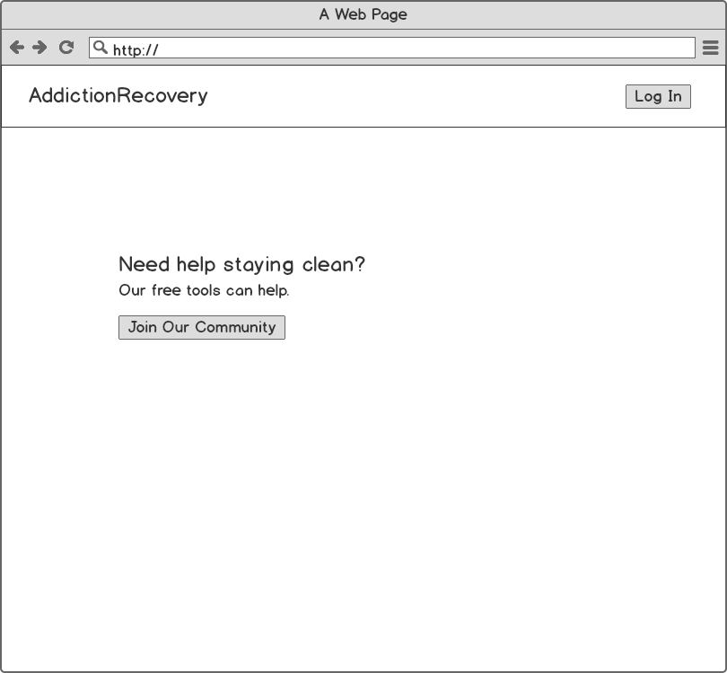
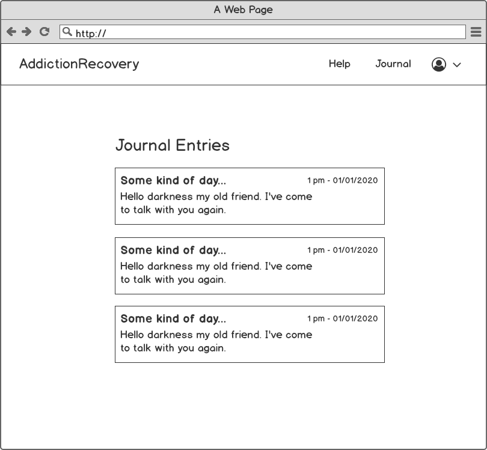
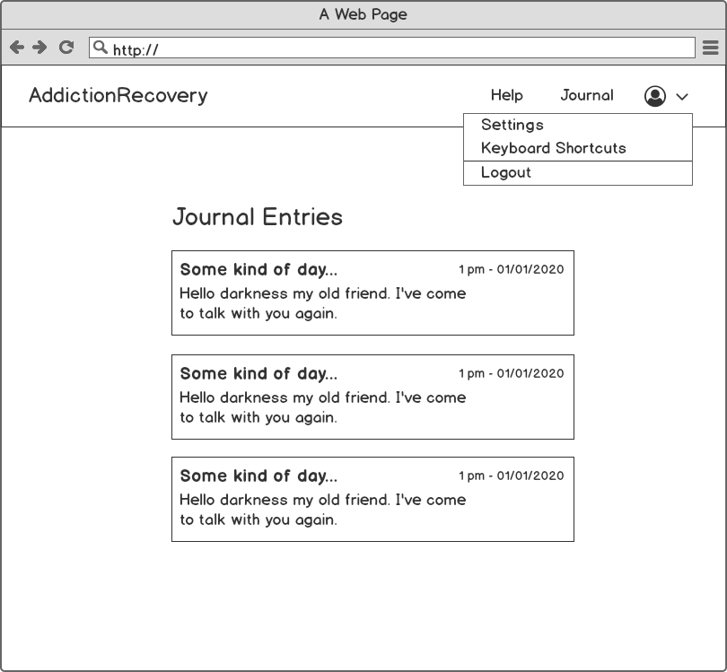
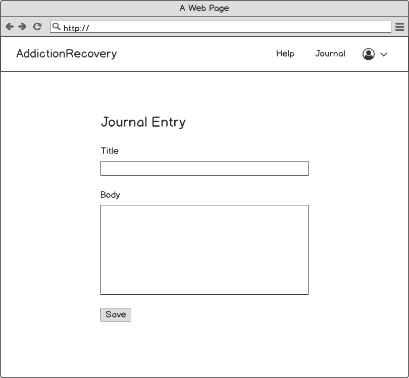
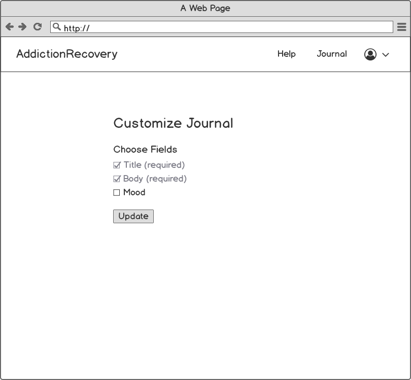
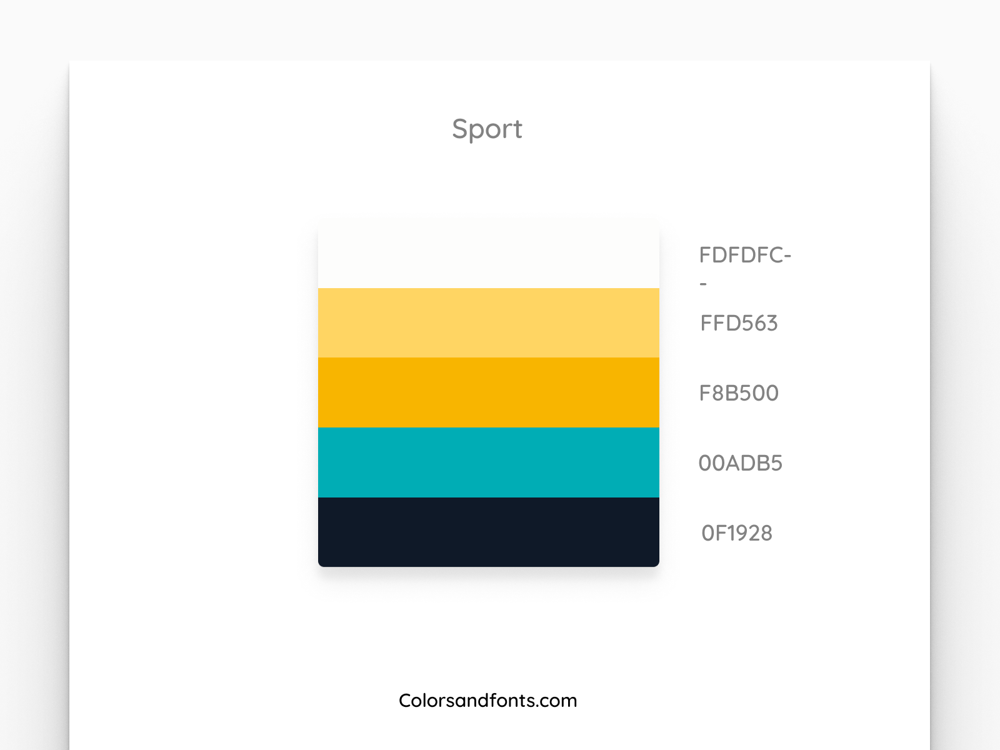

# Addiction Recovery

App to support people recovering from addiction with community and gamification elements.

*Currently building the MVP version of this application.*

## Requirements

### User stories

1. As a user, I want to be able to write in my journal everyday.
1. As a user, I can choose to be reminded to write in my journal and see prompts to get new inspiration.
1. As a user, I can see my progress and performance feedback over time.
1. As a user, I can find helpful, curated information for addiction recovery.

### Features

1. Gamification: individuals are incentivised to keep progressing through stages of recovery (levels) with titles, badges, and other forms of feedback like progress bars.

### Schema

**journal_entry**

* id: INT (pk)
* user_id: INT (fk)
* title: STR
* text: TEXT
* mood: INT (nullable)
* created_at: DATE
* updated_at: DATE

## Tech Stack

* Python 3
* Django 3
* Postgres

## Design Doc

### Mockups

### Color Scheme

**Colors:**
FDFDFC - FFD563 - F8B500 - 00ADB5 - 0F1928 - E44E4E (red)

